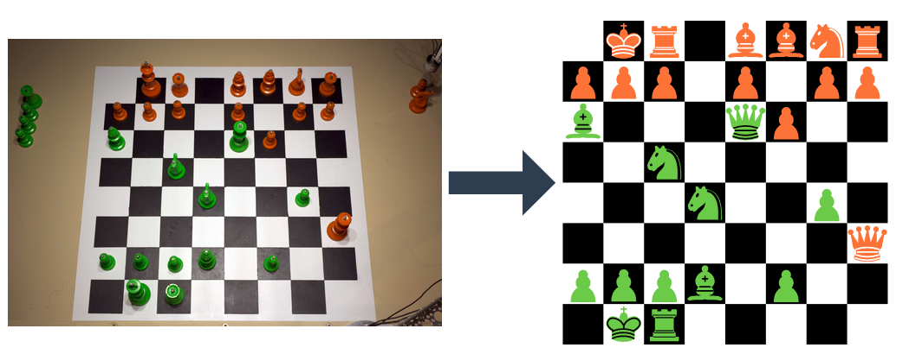
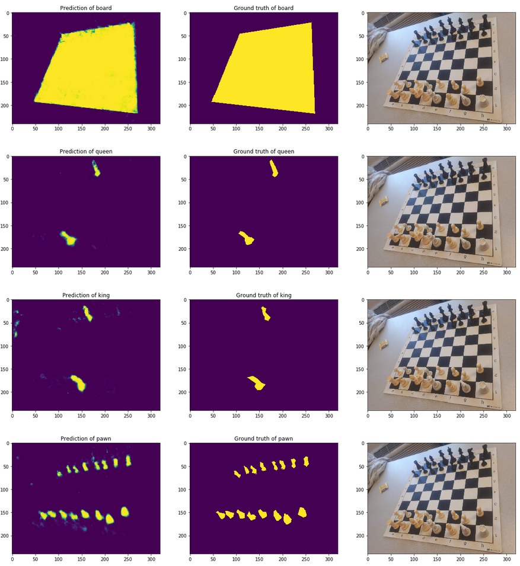

# Goal
The goal of this project is to take a picture of a chessboard and identify the configuration of the board using an end-to-end neural network. This approcach can be re-used for any board games (Go, puissance-4, dominos, poker...)

# Results
Open the notebook model_testing for all the results.

